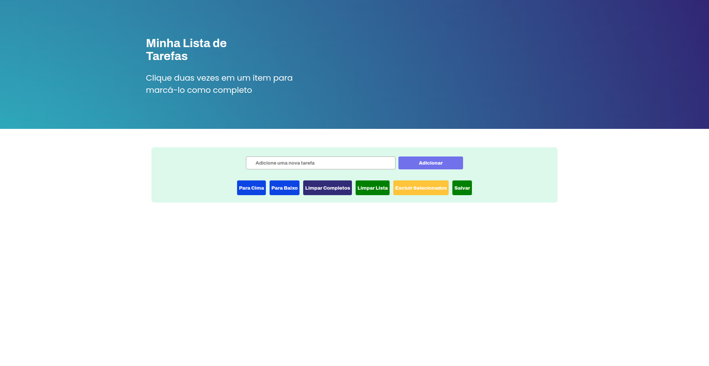
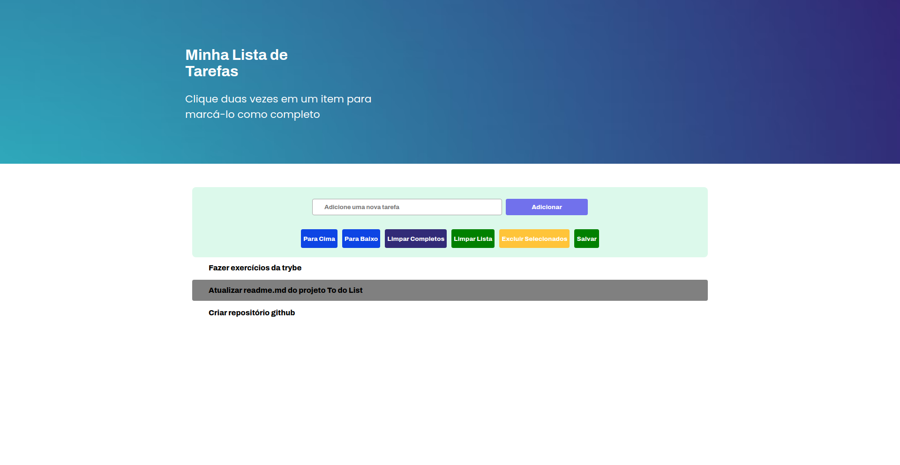
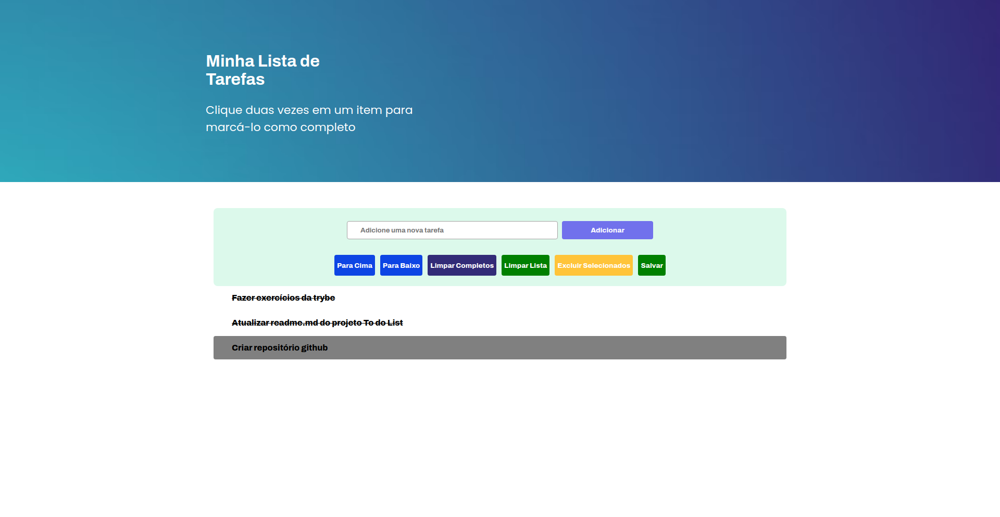

# To-do List 

O projeto To-do List, foi desenvolvido como requisito para obtensão de nota, referente ao curso de Desenvolvimento de Software na trybe, no módulo de fundamentos da Web, é uma página web que contém uma lista de tarefas usando que poderá ser utilizada pelo usuário para criar, excluir, cadastrar e mais ações abaixo descritas. Para isto foi ultilizado javascript, css e html.

<h4 align="center"> 
	🚧  To-do List 🚀 Concluído  🚧
</h4>

### :hotsprings: Habilidades 

As seguintes habilidades foram ultilizadas na construção do projeto:

- Manipulação CSS
- Manipulação HTML
- Manipulação JavaScript

### 🛠 Tecnologias

As seguintes ferramentas foram usadas na construção do projeto:

- [Html](https://htmlreference.io/)
- [Css](https://developer.mozilla.org/pt-BR/docs/Web/CSS)
- [JavaScript](https://developer.mozilla.org/pt-BR/docs/Web/javascript)
- [Vscode](https://code.visualstudio.com/)

### :dart: Principais ações

- [x] Lista as tarefas 
- [x] Cria novas tarefas
- [x] Exclui toda a lista
- [x] Move items para cima e para baixo
- [x] Marca tarefa como concluída
- [x] Salva lista no localStorage
- [x] Retorna lista do localStorage

### :movie_camera: Demonstração projeto pronto

<h1 align="center" >
  
     
      
     
    
</h1>